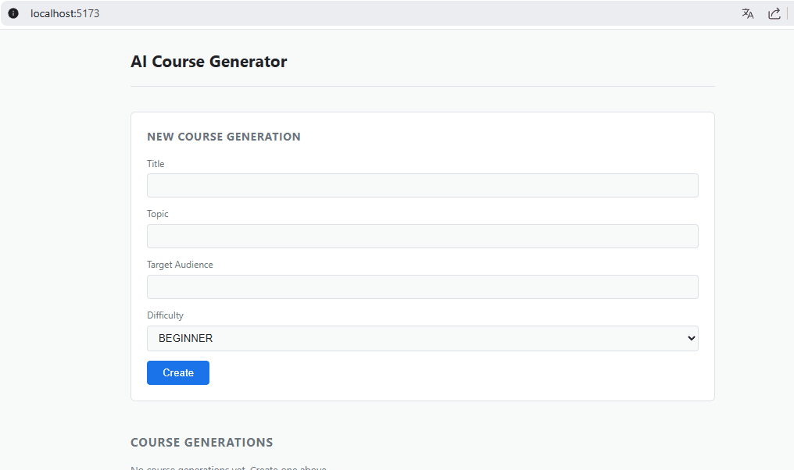
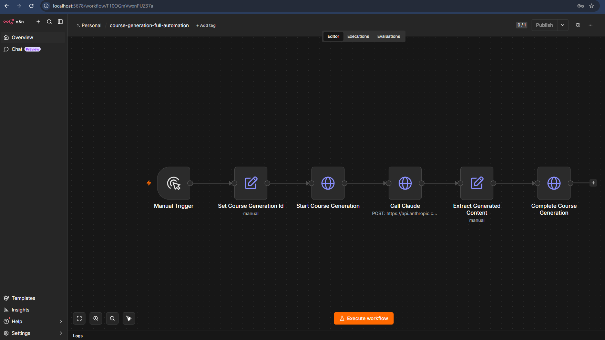
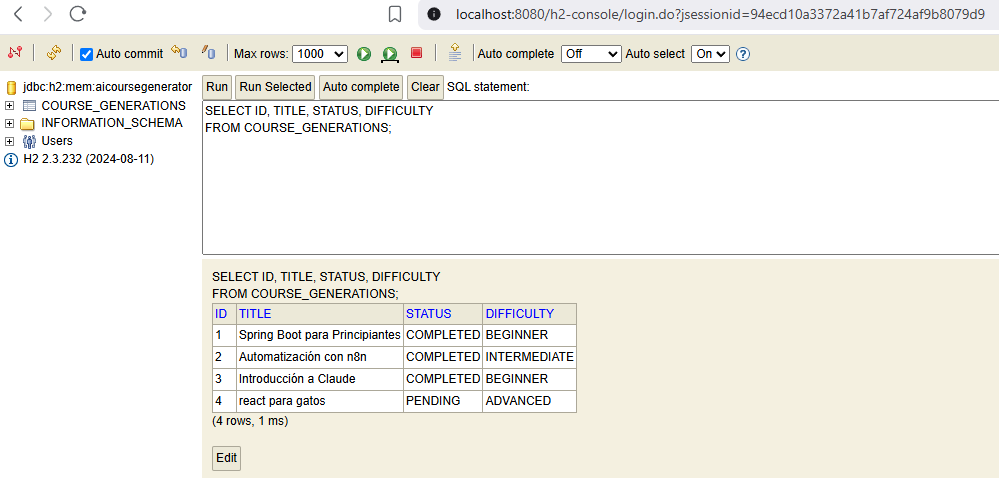

# AI Course Generator

Aplicación full stack para generar cursos utilizando Inteligencia Artificial y automatización.

El proyecto integra un frontend en React, un backend en Spring Boot y un flujo de automatización con n8n que orquesta la comunicación con proveedores de IA.

---

## Stack

### Frontend

- React
- Vite
- JavaScript

### Backend

- Spring Boot
- Java
- Spring Data JPA

### Base de datos

- H2 (desarrollo)
- MySQL (objetivo de producción)

### Automatización

- n8n

### IA

- Claude
- OpenAI (planificado)

### Multimedia (planificado)

- ElevenLabs
- Runway
- Midjourney

### Persistencia externa (planificado)

- Google Drive
- Gmail

---

## Arquitectura

```
Frontend (React)
        │
        ▼
Spring Boot REST API
        │
        ▼
      n8n
        │
        ├── Claude
        ├── OpenAI
        ├── Google Drive
        ├── Gmail
        ├── ElevenLabs
        └── Runway
```

---

## Flujo del sistema (end-to-end)

El sistema funciona mediante un flujo de generación automatizado de cursos:

1. El usuario solicita la creación de un curso desde el frontend (React).
2. El backend (Spring Boot) crea una entidad `CourseGeneration` en estado `PENDING`.
3. Se dispara el proceso de automatización mediante n8n.
4. n8n orquesta el flujo completo:
   - Llama al backend para iniciar la generación (`GENERATING`)
   - Construye el prompt del curso
   - Envía el prompt a un proveedor de IA (Claude)
   - Recibe el contenido generado
   - Envía el resultado nuevamente al backend
5. El backend actualiza la entidad a `COMPLETED` y guarda el contenido generado.

El backend no interactúa directamente con los proveedores de IA.
Toda la orquestación externa es responsabilidad de n8n.

---

## Capturas del proyecto

### Frontend

La aplicación permite crear cursos, consultar su estado y visualizar el flujo completo de generación.



---

### Workflow de automatización (n8n)

Workflow encargado de orquestar la comunicación entre Spring Boot y Claude mediante una secuencia de nodos HTTP y transformación de datos.



---

### Persistencia (H2)

La entidad `CourseGeneration` almacena el estado del proceso (`PENDING → GENERATING → COMPLETED`) junto con el contenido generado por IA.



---

## Responsabilidad de cada componente

### Spring Boot (Backend)
- Manejo del dominio (CourseGeneration)
- Persistencia de datos
- Validación de estado del flujo
- Exposición de API REST
- NO interactúa directamente con IA o servicios externos

### n8n (Automatización)
- Orquestación del flujo completo
- Integración con APIs externas (Claude, OpenAI, etc.)
- Coordinación entre backend y servicios de IA
- Transformación de datos entre pasos del proceso

### React (Frontend)
- Interfaz de usuario
- Consumo de API REST del backend
- No contiene lógica de negocio ni integraciones externas

---

## Decisión arquitectónica clave

Se decidió utilizar n8n como orquestador externo para desacoplar la lógica de automatización del backend.

Esto permite:
- Escalabilidad del sistema sin modificar el backend
- Integración rápida de nuevos proveedores de IA
- Menor complejidad en Spring Boot
- Flexibilidad para modificar workflows sin redeploy del backend

---

### Principios

- Spring Boot concentra la lógica de negocio.
- n8n orquesta los procesos de automatización.
- React consume únicamente la API REST.
- Los proveedores externos permanecen desacoplados del dominio.

---

## Estructura

```
ai-course-generator/
├── frontend-react/
├── backend-spring/
├── n8n/
├── docs/
└── README.md
```

---

## Estado del proyecto

- ✅ Sprint 1 — Foundation
- ✅ Sprint 2 — Backend
- ✅ Sprint 3 — Frontend
- ✅ Sprint 4 — Integración con IA
- ✅ Sprint 5 — Automatización
- ⏳ Sprint 6 — Multimedia
- ⏳ Sprint 7 — Persistencia avanzada
- ⏳ Sprint 8 — Calidad
- ⏳ Sprint 9 — Portfolio

---

## Documentación

La documentación de decisiones arquitectónicas y reglas del proyecto se encuentra en:

- `docs/PROJECT_DECISIONS.md`
- `docs/PROJECT_RULES.md`